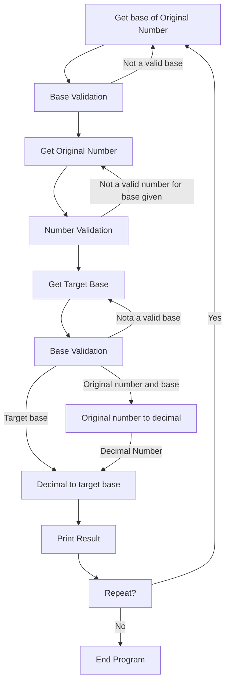

# Dylan Soule's Hexorcist

The hexorcist python script allows for you to convert any number in base 2-36 to any base 2-36

## Requirements
* Python 3
* Does not require any external libraries however the built in python time and sys libraries are used

## Installation
* Download the [hexorcist.py](./hexorcist.py) file  
* Import the file into a code running software such as vscode or you can run in the terminal  
* Run the file

## How to Use
Begin by running the file, run the command below in your terminal if you are doing it there
```bash
cd [file path to calc.py] | python3 calc.py
```
After running the file you will be prompted by the hexorcist to input your original number, original base and target base.  
The program will then convert your number to the base you specified  
After a conversion, you have the option to either do another one or quit the program

### Code Highlight
If you input either and invalid base or an invalid number in the base that you specified the program will catch that and ask you to re-input
```python
def base_input_validation(base):
    if not base.isnumeric():
        return base_input_validation(input("Please make sure your base is a positive integer "))
    elif int(base) > 36 or int(base) < 2:
        return base_input_validation(input("Please make sure your base from 2-36(inclusive) "))
    return base
    

def number_input_validation(number, base):
    number = number.upper()
    if not number.isalnum():
        return number_input_validation(input("Only alphanumeric values please, I don't have forever "),base)
    elif not set(number) <= set(alphanumeric[0:(int(base))+1]):
        return number_input_validation(input("Make sure that your number is in the correct base "),base)
    return number
```

## Program Flow
* The program works according to the chart below


## Testing
**The file can be tested using pytest**

In order to test the file, first make sure you have installed both the [calc.py](./calc.py) and the [test_hexorcist.py](./test_hexorcist.py) files, and they are both in the same directory.

Then in order to test the file, run the following commands in your terminal
```bash
cd [path to directory file is located]
pytest test_hexorcist.py
```
